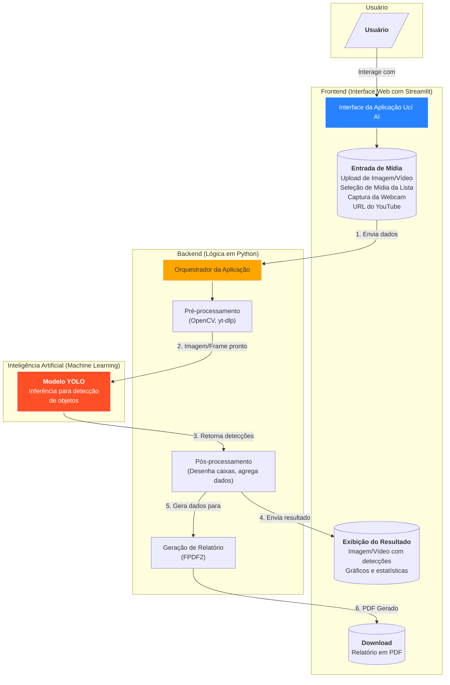

# Ucí AI - Análise de Materiais Recicláveis com IA

Ucí AI (do Nhengatu, onde 'Ucí' significa 'Limpar') é uma aplicação web desenvolvida com Streamlit que utiliza um modelo de detecção de objetos (YOLO) para identificar materiais recicláveis (garrafas, latas, etc.) em imagens e vídeos.

## 📜 Descrição

A aplicação oferece uma interface interativa para que os usuários possam realizar análises de materiais a partir de diversas fontes. O sistema processa o conteúdo, identifica os materiais recicláveis e apresenta um relatório consolidado com estatísticas e gráficos.

## 🔗 Links Úteis
- **Repositório GitHub:** [https://github.com/jpscard/uci_ai/tree/main](https://github.com/jpscard/uci_ai/tree/main)
- **Aplicação Streamlit:** [https://uciaiv1.streamlit.app/](https://uciaiv2.streamlit.app/)

## 🗺️ Fluxograma da Arquitetura



## ✨ Funcionalidades

- **Interface Intuitiva**: Navegação simplificada com abas para cada funcionalidade.
- **Análise Multi-fonte**: Analise materiais a partir de:
    - **Imagens**: Faça upload de arquivos de imagem ou selecione de uma lista pré-definida.
    - **Vídeos**: Envie arquivos de vídeo ou selecione de uma lista pré-definida.
    - **Webcam**: Realize detecção em tempo real usando sua webcam.
    - **YouTube**: Cole a URL de um vídeo do YouTube para análise direta.
- **Contagem de Itens em Vídeos**:
    - **Área de Interesse (ROI) e Linha de Contagem Ajustáveis**: Configure uma área de interesse e uma linha de contagem para contar objetos que cruzam a linha na direção especificada.
    - **Rastro de Objetos**: Visualize o rastro dos objetos detectados para entender melhor o seu movimento.
    - **Comprimento do Rastro Ajustável**: Controle o comprimento do rastro dos objetos.
- **Modelo de Detecção YOLO**: Utiliza um modelo `ultralytics` treinado para identificar e classificar objetos de interesse.
- **Relatórios Detalhados**: Ao final da análise, um relatório consolidado é gerado, incluindo:
    - Tabela com dados de detecção.
    - Gráficos de análise.
    - Opção para baixar o relatório completo em formato **PDF**.
- **Visualização de Desempenho**: Uma seção dedicada para visualizar as métricas de desempenho do modelo de IA, como mAP, Precisão e Recall.
- **Seção ODS**: A tela de boas-vindas agora inclui uma seção sobre os Objetivos de Desenvolvimento Sustentável (ODS) 11, 12 e 17.

## ⚙️ Configurações da Análise

A barra lateral da aplicação permite ajustar as seguintes configurações:

- **Ajuste a Confiança do Modelo**: Defina o limiar de confiança para a detecção de objetos.
- **Habilitar Contagem de Itens**: Ative ou desative a funcionalidade de contagem de itens em vídeos.
- **Configuração da Área de Contagem**:
    - **Posição Vertical Central da Área (%)**: Defina o centro da faixa de contagem.
    - **Altura da Área (%)**: Defina a espessura da faixa de contagem.
- **Configuração da Linha de Contagem**:
    - **Direção da Contagem**: Escolha a direção em que os objetos serão contados ao cruzar a linha.
    - **Posição da Linha de Contagem (%)**: Defina a posição da linha dentro da área de contagem.
    - **Comprimento do Rastro**: Defina o comprimento do rastro dos objetos detectados.

## 🚀 Como Executar o Projeto

1.  **Clone o repositório.**
2.  **Crie e ative um ambiente virtual:**
    ```bash
    python -m venv .venv
    source .venv/bin/activate  # Linux/macOS
    .venv\Scripts\activate  # Windows
    ```
3.  **Instale as dependências:**
    ```bash
    pip install -r requirements.txt
    ```
4.  **Execute a aplicação Streamlit:**
    ```bash
    streamlit run app.py
    ```

## 👨‍💻 Equipe

O projeto foi desenvolvido pelo **Grupo 5**, composto pelos seguintes membros:

- Felipe Rafael dos Santos Barbosa
- João Paulo da Silva Cardoso
- Victor Amazonas Viegas Ferreira

## Licença

MIT License

Copyright (c) 2025 Felipe Rafael dos Santos Barbosa, João Paulo da Silva Cardoso, and Victor Amazonas Viegas Ferreira

Permission is hereby granted, free of charge, to any person obtaining a copy
of this software and associated documentation files (the "Software"), to deal
in the Software without restriction, including without limitation the rights
to use, copy, modify, merge, publish, distribute, sublicense, and/or sell
copies of the Software, and to permit persons to whom the Software is
furnished to do so, subject to the following conditions:

The above copyright notice and this permission notice shall be included in all
copies or substantial portions of the Software.

THE SOFTWARE IS PROVIDED "AS IS", WITHOUT WARRANTY OF ANY KIND, EXPRESS OR
IMPLIED, INCLUDING BUT NOT LIMITED TO THE WARRANTIES OF MERCHANTABILITY,
FITNESS FOR A PARTICULAR PURPOSE AND NONINFRINGEMENT. IN NO EVENT SHALL THE
AUTHORS OR COPYRIGHT HOLDERS BE LIABLE FOR ANY CLAIM, DAMAGES OR OTHER
LIABILITY, WHETHER IN AN ACTION OF CONTRACT, TORT OR OTHERWISE, ARISING FROM,
OUT OF OR IN CONNECTION WITH THE SOFTWARE OR THE USE OR OTHER DEALINGS IN THE
SOFTWARE.
